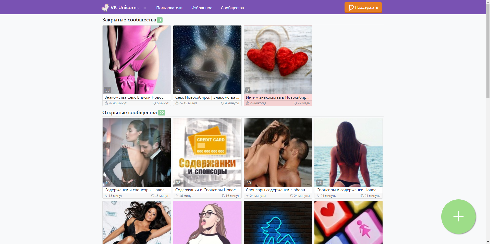
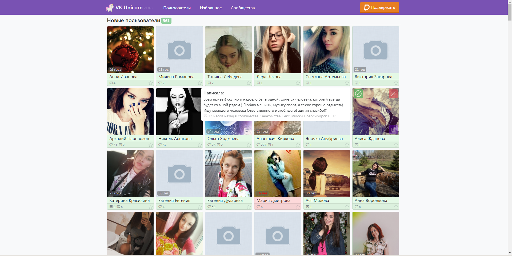
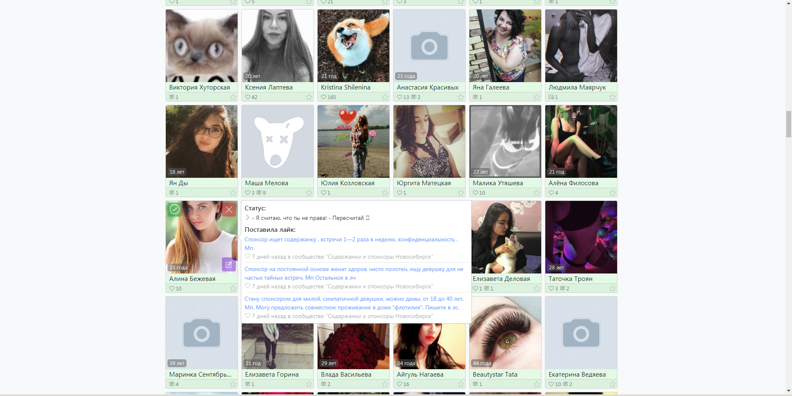

# VK Unicorn
> VK Unicorn это программа для автоматического сканирования сообществ в социальной сети "ВКонтакте" Из сообществ выбираются ссылки на пользователей, подходящие под опредлённые критерии и составляется удобный каталог этих пользователей для дальнейшего взаимодействия Проще говоря - это бот, который сканирует паблики твоего города и ищет там странички девушек, которые не против познакомиться

### Скриншоты

 
 
 

### Особенности и основные ориентиры при разработке:
- Бесплатно и для всех. Никаких "премиум" версий с расширенным функционалом за деньги
- Полностью открытый исходный код с понятными и подробными комментариями на русском языке
- Компиляция в один единственный exe файл, никаких разбросанных dll, конфигов и прочего мусора
- Работа с одним единственным файлом базы данных database.db, который создаётся в папке с exe файлом программы. При необходимости этот файл можно открыть и редактировать практически любой программой для работы с базами данных. Например через [Navicat](https://www.navicat.com/en/products/navicat-for-sqlite)
- Не оставляет следов в системе. Никаких ключей в реестре, разбросанных временных файлов и т.п.
- Борьба с ботами и спамом, постоянное обновление и улучшение эвристических правил
- Упор на максимальную осторожность в работе с API ВКонтакте: получать только самое необходимое, выжидать требуемые таймауты, соблюдать самые строгие ограничения и лимиты, отсылать как можно меньше запросов и паковать однотипные запросы в [execute](https://vk.com/dev/execute) вызовы. Всё это не в ущерб скорости работы, полное первоначальное сканирование 25 сообществ занимает примерно 35 минут. Повторное сканирование происходит практически мгновенно.
- Интерфейс полностью на русском языке. Подробное описание всех элементов настроек и шагов выполнения программы
- Регулярная поддержка, обновления и оперативное исправление багов, если они будут

### Используемые инструменты, фреймворки, пакеты и архитектурные решения:
- C# - прекрасный язык, я использую его и в качестве основного языка для своей работы по созданию игр на Unity. Под платформу .NET сделано очень много постоянно обновляемых полезных библиотек
- [VkNet](https://www.nuget.org/packages/VkNet). Очень удобная реализация взаимодействия с API ВКонтакте для .NET
- [sqlite-net-pcl](https://www.nuget.org/packages/sqlite-net-pcl). Реализация взаимодействия с SQLite базами данных. SQLite это очень надёжная, компактная встраиваемая СУБД, которая не использует парадигму клиент-сервер, то есть движок SQLite не является отдельно работающим процессом, с которым взаимодействует программа, а представляет собой библиотеку, с которой программа компонуется, и движок становится составной частью программы. Проще говоря - SQLite это меньше мусора, просто и компактно
- [Costura.Fody](https://www.nuget.org/packages/Costura.Fody). Позволяет упаковать все dll файлы проекта в один компактный exe файл
- [Bootstrap](https://getbootstrap.com/). Один из самых популярных инструментов для создания сайтов и веб-приложений. Разработка веб-части ведётся под Google Chrome и дополнительно проверяется на совместимость с Mozilla Firefox
- Свой маленький "веб сервер". Всё-таки хочется смотреть и взаимодействовать с результатами работы программы в привычном веб-браузере, поэтому чтобы не привязываться к какому-нибудь [Apache веб серверу](https://httpd.apache.org/) было принято решение реализовать свой, встроенный. Это совсем не сложно, зато гораздо меньше зависимостей и не требуется никакая дополнительная настройка
- Умеренно простая архитектура кода. Вот такой ["Enterprise" стиль](https://gist.github.com/lolzballs/2152bc0f31ee0286b722) не приветствуется. Для небольших проектов это плохо, когда для выполнения простейшего действия требуется писать сотни строк кода. Пусть будут и не такие мощные абстракции, но зато потом программу проще поддерживать и модифицировать
- Русский язык. Программа делается целиком и полностью под аудиторию стран бывшего СССР, а поэтому, в виде исключения, я не вижу смысла использовать английский язык для комментариев в коде и в интерфейсе
- Корректная терминология в коде и комментариях. Не профиль\анкета\страничка, а пользователь. Не группа\паблик, а сообщество. [Документация](https://vk.com/dev/objects)
- Целевая платформа разработки - Windows. Поддержка остальных платформ не планируется. Мобильная версия не планируется

## 💬 Удачи, и пусть тебе улыбаются единороги!

